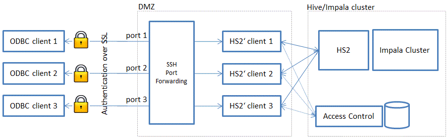

## Getting the source code

git checkout cdh4-0.10.0_4.5.0

## Build and package

```bash
ant compile -Dthrift.home=/usr/local
ant package
```

## Dependencies at runtime

* http://repo1.maven.org/maven2/org/glassfish/jersey/core/jersey-common/2.7/jersey-common-2.7.jar
* http://repo1.maven.org/maven2/org/glassfish/jersey/core/jersey-client/2.7/jersey-client-2.7.jar
* http://repo1.maven.org/maven2/javax/ws/rs/javax.ws.rs-api/2.0/javax.ws.rs-api-2.0.jar
* http://repo1.maven.org/maven2/org/glassfish/hk2/hk2-api/2.2.0/hk2-api-2.2.0.jar
* https://maven.java.net/content/repositories/releases/org/glassfish/jersey/bundles/repackaged/jersey-guava/2.7/jersey-guava-2.7.jar

## Configuration

The configuration is added to the hive-site.xml file.

### Configure the actual Impala server

```xml
  <property>
    <name>multitenant.delegate.host</name>
    <value>host name</value>
  </property>
  <property>
    <name>multitenant.delegate.port</name>
    <value>port number</value>
  </property>
```

The actual Impala server can also be set on the command line. (Command line overwrites the configuration file)

```bash
export MULTITENANT_DELEGATE_HOST=host
export MULTITENANT_DELEGATE_PORT=port
```

### Configure the server for the access control

```xml
  <property>
    <name>multitenant.acl.uri</name>
    <value>fake</value>
  </property>
```

The access control server must implement a JSON REST service that validates an SQL statement for a given user. If the user has permission to execute the query, the service must return code 200.
```
  GET /access?user=<user name>&sql=<sql statement>
```

For testing purposes, you can use the value "ignore" for multitenant.acl.uri. This special value will grant permission to every request.

## Security

The SSL functionality as defined in the HiveServer2 (SSL Thrift) is supported.

### SSL Configuration

[Generate a Java keystore and key pair](http://www.sslshopper.com/article-most-common-java-keytool-keystore-commands.html)
```bash
keytool -genkey -alias mydomain -keyalg RSA -keystore keystore.jks -keysize 2048
```

The domain name (asked during the key generation) must fit the name of the machine on which the server runs. See [Cloudera's documentation] (http://www.cloudera.com/content/cloudera-content/cloudera-docs/CDH4/latest/CDH4-Security-Guide/cdh4sg_topic_9_1.html#concept_zqx_dc5_fm_unique_1) for more details.

```xml
  <property>
    <name>hive.server2.enable.SSL</name>
    <value>true</value>
  </property>
  <property>
    <name>hive.server2.keystore.path</name>
    <value>/opt/cloudera/parcels/CDH/lib/hive/conf/keystore.jks</value>
  </property>
  <property>
    <name>hive.server2.keystore.password</name>
    <value>your_password</value>
  </property>  
```

### Special use case

If you are running the server in **NOSASL** or **SASL/No Authentication** mode (as is the case for the ODBC Impala driver), it is not possible to specify a user name. In this case, the multi tenant server allows to define a global user name for the server. This global user name will be used for verifying the permissions. 

In order to separate the different users, each user accesses a dedicated multi tenant server (eventually over a SSL tunnel). Each multi tenant server has its own server port and its own instance name. But all the multi tenant servers target the same Impala cluster.

```xml
  <property>
    <name>multitenant.instance</name>
    <value>some name to be used with the acl</value>
  </property>
```

The instance name can also be set on the command line. (The command line overwrites the configuration file)

```bash
  export MULTITENANT_INSTANCE=value
```

## Set up one server instance per client

```bash
export MULTITENANT_INSTANCE=client_XXX
export HIVE_SERVER2_THRIFT_PORT=port_client_XXX
hive --service hiveserver2
```


